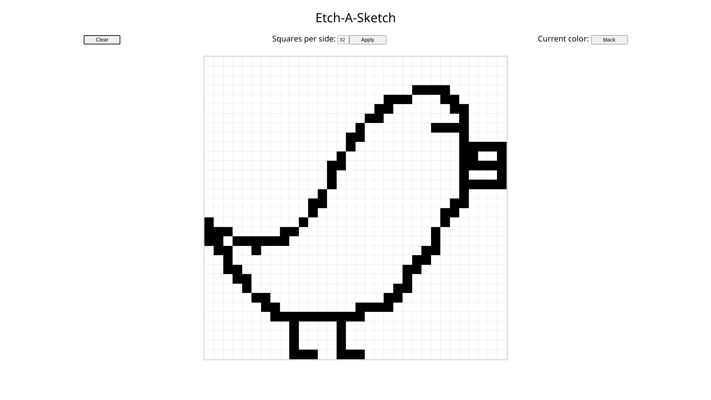

# Etch-A-Sketch

Etch-A-Sketch with the mouse, made as part of [The Odin Project's web
development 101
course](https://www.theodinproject.com/courses/web-development-101/lessons/etch-a-sketch-project),
to become familiar with JavaScript and DOM manipulation.

## Usage

- Visit the [game's page here](https://lukylurks.github.io/etch-a-sketch/)
- Enter a resolution and click "Apply" to get a new grid with those parameters
- Hover your mouse around the grid

## Structure

The project follows the structure explained in [this MDN
article](https://developer.mozilla.org/en-US/docs/Learn/Getting_started_with_the_web/Dealing_with_files).

- [scripts](./scripts/): things that make the game work.
  [main.js](./scripts/main.js) controls the application, and depends on
utilities from [lib.js](./scripts/lib.js) accessed through
[require.js](./scripts/require.js) from https://requirejs.org/, in an attempt to
keep the code modular.
- [styles](./styles/): [Eric Mayer's CSS
  reset](https://meyerweb.com/eric/tools/css/reset/) and my own CSS
- [index.html](./index.html): all the HTML code

## License

This project is licensed under the [MIT license](./LICENSE).
